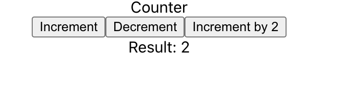

# Redux Toolkit

### How to run the project

1. Step 1: yarn
2. Step 2: yarn start

### Requirements

1. add logic in `counter.ts` in slices folder
2. create store in `store.ts` file
3. provide the store for the whole application in the `index.tsx` file
4. use the `useSelector` and `useDispatch` in the `Counter.tsx` file

### Practice syntax

1. display the result in the `Child1` component
2. add a button in `Child2` component and dispatch actions: increment and decrement

### Screenshots

